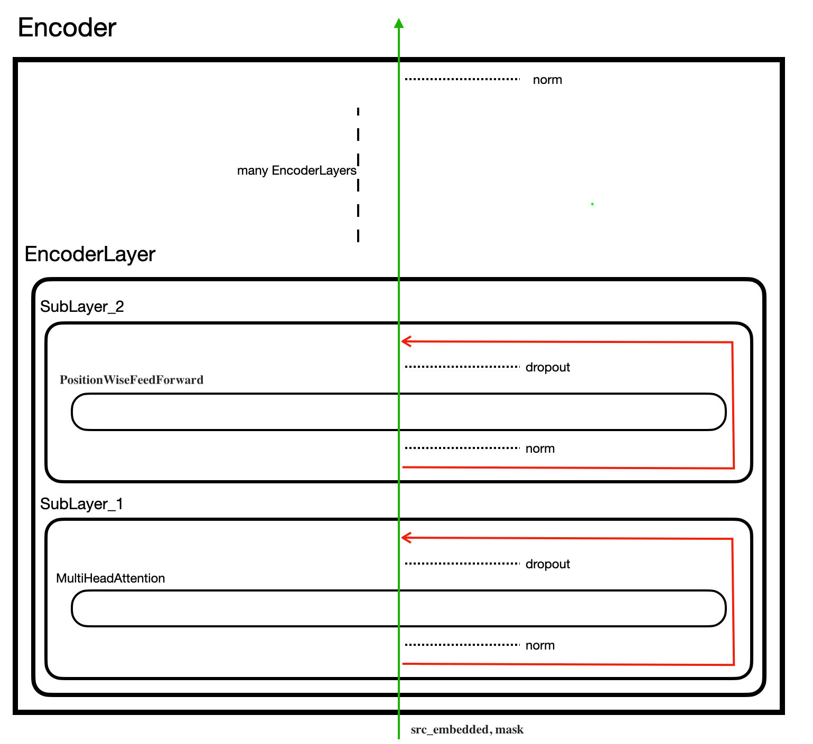

# The annotated "annotated Transformers"

## The purpose of this tutorial

The paper "Attention is all you need" by [Vaswani et. al](https://arxiv.org/abs/1706.03762) introduced a very powerful language model framework -***Transformers***- in 2017. [Devlin et al.](https://arxiv.org/abs/1810.04805) from Google adopted this methodology to fulfill unsupervised language tasks and trained a ground-breaking language model which opens a new era for NLP. 

Given the popularity of ***Transformers***, understanding its architecture is not a trivial matter. The great tutorial "[The annotated Transformer](https://nlp.seas.harvard.edu/2018/04/03/attention.html)" by Harvard NLP makes things much easier. However, when I read the tutorial, I realized there could be a more detailed way to present the whole structure of Transformers. Therefore, I came up with the idea of recording how I understand every detail of this Transformer architecture. Compared with "The annotated Transformer", this note looks deeper into some key classes (such as the "MultiHeadAttention" class) or methods and provides much friendly and verbose explanation for those who find it somewhat unclear when reading other tutorials prepared for more experienced practitioners.

At the very beginning, let's first take a look at the popular figure showing the whole structure of Transformers. When I first saw this figure, I should admit that I only grasped some vague idea but didn't know how it's implemented in practice.


In this tutorial, we focus on the Encoder (left) side of Transformers. The Decoder (right) side is quite similar and thus we do not talk about it here. 

In general, we adopt the codes from "The annotated Transformer", but explain and organize them in a way that is easy to follow and we can implement in a Jupyter notebook line by line. When the python classes and methods are easy to understand, we will adopt them directly. Otherwise, we will split them into several steps so that we can see how things work. 

## Step0: Prelims

The prelims are the same as in "The annotated Transformer". Before we start, we should install the following python packages. Note that by copying and pasting the following coding blocks in the python interactive interpreter  and executing them in the same order, we are able to see how data flows through the model. So let's open a Jupyter Notebook and start. 

```python
import numpy as np
import torch
import torch.nn as nn
import torch.nn.functional as F
import math, copy, time
from torch.autograd import Variable
import matplotlib.pyplot as plt
import seaborn
```

## Step1: Synthetic Data Generation

Before we look into the Encoder, we generate some synthetic data to feed forward through the whole Encoder. We first define a data generation method *data_gen.*

```python
def data_gen(V, batch, nbatches):
    "Generate random data for a src-tgt copy task."
    for i in range(nbatches):
        data = torch.from_numpy(np.random.randint(1, V, size=(batch, 10)))
        data[:, 0] = 1
        src = Variable(data, requires_grad=False)
        tgt = Variable(data, requires_grad=False)
        yield Batch(src, tgt, 0)
```

To use this method, we need to define a Batch class beforehand. 

```python
class Batch:
    "Object for holding a batch of data with mask during training."
    def __init__(self, src, trg=None, pad=0):
        self.src = src
        self.src_mask = (src != pad).unsqueeze(-2)
        if trg is not None:
            self.trg = trg[:, :-1]
            self.trg_y = trg[:, 1:]
            self.trg_mask = \
                self.make_std_mask(self.trg, pad)
            self.ntokens = (self.trg_y != pad).data.sum()
    
    @staticmethod
    def make_std_mask(tgt, pad):
        "Create a mask to hide padding and future words."
        tgt_mask = (tgt != pad).unsqueeze(-2)
        tgt_mask = tgt_mask & Variable(
            subsequent_mask(tgt.size(-1)).type_as(tgt_mask.data))
        return tgt_mask
```

When defining the Batch class, we also need to define a subsequent_mask method as follows.

```python
def subsequent_mask(size):
    "Mask out subsequent positions."
    attn_shape = (1, size, size)
    subsequent_mask = np.triu(np.ones(attn_shape), k=1).astype('uint8')
    return torch.from_numpy(subsequent_mask) == 0
```

Now the data_gen method is ready. We use this method to create a batch of sentence sequences.

```python
V = 11
data_iter = data_gen(V, 30, 20)
example_batch = next(data_iter)
```

data_iter is a python generator. We get a batch out of it and store in example_batch. We can explore this batch a little bit. src is a batch of original input sequences and mask is a batch of corresponding mask sequences.

```python
src = example_batch.src
src.shape
# torch.Size([30, 10])
mask = example_batch.src_mask
mask.shape
```

Each batch is consisted of 30 sequences (or sentences), each of which is a sequence of 10 numbers (words id)。The word id ranges from 1 to 10, representing 10 different words. Here we assume that there is only 10 words in the vocabulary.  

```
# This is not a code block.
# src is a tensor with a shape of (30, 10).
tensor([[ 1,  9,  1,  3,  3,  7,  4,  8,  9,  6],
        [ 1,  3,  8,  6,  5,  1,  9,  3,  6,  7],
        [ 1,  8,  4,  8,  7,  7,  6,  4,  3,  5],
        [ 1,  4,  2,  5,  9,  4,  2,  2,  7,  2],
        [ 1,  5,  7,  3,  7,  4,  8,  9, 10,  1],
        [ 1,  7,  6,  3,  1,  2,  8,  7,  3,  7],
        [ 1,  6,  4, 10, 10,  1,  1,  8,  1,  7],
        [ 1,  3,  8,  9,  9,  1,  4,  5,  1,  6],
        [ 1,  6,  2,  3,  5,  8,  4,  5,  8,  6],
        [ 1,  7, 10,  5,  6,  3,  9,  9,  5, 10],
        [ 1,  3,  7, 10,  3,  4,  7,  3,  8,  1],
        [ 1,  3,  7,  9,  2,  9,  9,  6,  6,  9],
        [ 1,  3,  2,  1,  3,  1,  9,  2,  6,  5],
        [ 1, 10,  3,  1,  1,  2, 10, 10,  7,  6],
        [ 1,  6, 10,  7,  9,  9,  8,  5,  4,  4],
        [ 1,  9,  3,  6,  6,  9,  3,  6,  8,  2],
        [ 1,  7,  3,  8,  2,  4,  1, 10,  5,  3],
        [ 1,  8,  4,  7,  4,  6,  3,  7,  5,  5],
        [ 1,  7,  3,  8, 10,  8,  9,  3,  5,  8],
        [ 1,  3,  2,  3, 10, 10,  3,  7,  5,  8],
        [ 1,  2,  1,  7,  7,  6,  6,  1,  2,  9],
        [ 1, 10,  5,  8, 10,  7,  5, 10,  5,  7],
        [ 1,  1,  6, 10,  9,  2,  3,  7,  7, 10],
        [ 1,  4,  7, 10,  2,  8,  2,  6,  7,  6],
        [ 1,  2,  9,  8,  4,  3,  6,  4,  6,  8],
        [ 1,  9,  5,  6,  7, 10,  2,  1,  9,  7],
        [ 1,  2,  7,  9,  4,  3, 10,  7,  5,  4],
        [ 1,  7,  9,  6,  4,  6,  4, 10,  9,  7],
        [ 1,  5,  1,  6,  2,  4,  1,  4, 10,  5],
        [ 1,  2, 10,  9,  7,  1,  8,  7,  3,  6]])
```

## Step2: Word embedding

### Word value embedding

Next, we project src (original sequence input) into word embeddings. The word id as a integer can not capture the meaning of the word and is subject to the problem of sparsity. By word embedding, each word id is transformed into a point in a high dimensional space. For example, we project a word id into a 512 dimensional space.

```python
d_model = 512 # the number of dimensions of the high dimensional space
src_vocab = V # the vocabulary size of the dictionary, equals to d_model + 1
```

We create a Embedding class to convert src into word embeddings.

```python
class Embeddings(nn.Module):
    def __init__(self, d_model, vocab):
        super(Embeddings, self).__init__()
        self.lut = nn.Embedding(vocab, d_model)
        self.d_model = d_model

    def forward(self, x):
        return self.lut(x) * math.sqrt(self.d_model)

value_embedding = Embeddings(d_model, src_vocab)
src_embedded = value_embedding(src)
src_embedded.shape
```

Let's take a look at the embedded src. Each word id is converted into an array of 512 numbers. The numbers are the result of the word embedding process. To do word embedding, we need a look-up table which has a shape of (10, 512) and contains parameters which will be trained during the training process. For instance, if the word id is 5, we take out the the fifth row of the look-up table and take it as the word's representation.

```
# this is not a code block
# src_embedded is a tensor with a shape of (30, 10, 512)
tensor([[[-25.6373,   9.9650,  14.6112,  ..., -65.3521,   0.6748, -40.5881],
         [ -2.8126, -27.7541, -12.7870,  ...,  73.4725,  25.2440,  31.4001],
         [-25.6373,   9.9650,  14.6112,  ..., -65.3521,   0.6748, -40.5881],
         ...,
         [-18.0050, -13.9900,  22.6879,  ...,  10.4840, -17.8149,   5.7743],
         [ -2.8126, -27.7541, -12.7870,  ...,  73.4725,  25.2440,  31.4001],
         [ 15.8259,  16.3906,  -2.1692,  ...,  15.2388, -12.5178,  15.4884]],

        [[-25.6373,   9.9650,  14.6112,  ..., -65.3521,   0.6748, -40.5881],
         [ -4.1235, -16.8644,   9.4373,  ..., -20.9094, -11.9211, -32.4937],
         [-18.0050, -13.9900,  22.6879,  ...,  10.4840, -17.8149,   5.7743],
         ...,
         [ -4.1235, -16.8644,   9.4373,  ..., -20.9094, -11.9211, -32.4937],
         [ 15.8259,  16.3906,  -2.1692,  ...,  15.2388, -12.5178,  15.4884],
         [ 24.6336, -23.5297,  44.2649,  ..., -15.4722,   5.5116,  21.7884]],

        [[-25.6373,   9.9650,  14.6112,  ..., -65.3521,   0.6748, -40.5881],
         [-18.0050, -13.9900,  22.6879,  ...,  10.4840, -17.8149,   5.7743],
         [-15.9895,   9.4439, -26.1173,  ...,  -5.7927,  18.0344, -33.6239],
         ...,
         [-15.9895,   9.4439, -26.1173,  ...,  -5.7927,  18.0344, -33.6239],
         [ -4.1235, -16.8644,   9.4373,  ..., -20.9094, -11.9211, -32.4937],
         [-18.1641, -28.1053,  21.0261,  ...,  10.3796,  -2.5790, -11.3835]],

        ...,

        [[-25.6373,   9.9650,  14.6112,  ..., -65.3521,   0.6748, -40.5881],
         [ 24.6336, -23.5297,  44.2649,  ..., -15.4722,   5.5116,  21.7884],
         [ -2.8126, -27.7541, -12.7870,  ...,  73.4725,  25.2440,  31.4001],
         ...,
         [-23.0361,   7.7318,   2.7496,  ...,   3.1389,  -2.8598, -23.8702],
         [ -2.8126, -27.7541, -12.7870,  ...,  73.4725,  25.2440,  31.4001],
         [ 24.6336, -23.5297,  44.2649,  ..., -15.4722,   5.5116,  21.7884]],

        [[-25.6373,   9.9650,  14.6112,  ..., -65.3521,   0.6748, -40.5881],
         [-18.1641, -28.1053,  21.0261,  ...,  10.3796,  -2.5790, -11.3835],
         [-25.6373,   9.9650,  14.6112,  ..., -65.3521,   0.6748, -40.5881],
         ...,
         [-15.9895,   9.4439, -26.1173,  ...,  -5.7927,  18.0344, -33.6239],
         [-23.0361,   7.7318,   2.7496,  ...,   3.1389,  -2.8598, -23.8702],
         [-18.1641, -28.1053,  21.0261,  ...,  10.3796,  -2.5790, -11.3835]],

        [[-25.6373,   9.9650,  14.6112,  ..., -65.3521,   0.6748, -40.5881],
         [ 21.7762, -16.9745, -20.6290,  ...,   7.7126,  14.2988,   8.8450],
         [-23.0361,   7.7318,   2.7496,  ...,   3.1389,  -2.8598, -23.8702],
         ...,
         [ 24.6336, -23.5297,  44.2649,  ..., -15.4722,   5.5116,  21.7884],
         [ -4.1235, -16.8644,   9.4373,  ..., -20.9094, -11.9211, -32.4937],
         [ 15.8259,  16.3906,  -2.1692,  ...,  15.2388, -12.5178,  15.4884]]],
       grad_fn=<MulBackward0>)
```

### Word position embedding

Unlike sequence-to-sequence models which inherently takes the position information into consideration, transformers need to include the position information additionally. To do this, we define a PostionalEncoding class.

```python
class PositionalEncoding(nn.Module):
    "Implement the PE function."
    def __init__(self, d_model, dropout, max_len=5000):
        super(PositionalEncoding, self).__init__()
        self.dropout = nn.Dropout(p=dropout)
        
        # Compute the positional encodings once in log space.
        pe = torch.zeros(max_len, d_model)
        position = torch.arange(0, max_len).unsqueeze(1)
        div_term = torch.exp(torch.arange(0, d_model, 2) *
                             -(math.log(10000.0) / d_model))
        pe[:, 0::2] = torch.sin(position * div_term)
        pe[:, 1::2] = torch.cos(position * div_term)
        pe = pe.unsqueeze(0)
        self.register_buffer('pe', pe)
        
    def forward(self, x):
        x = x + Variable(self.pe[:, :x.size(1)], 
                         requires_grad=False)
        return self.dropout(x)
```

We won't explain the mechanism of position embedding here as it is not our priority in this note. We only need to remember that we will add the position information to the input sequence.

```python
position = PositionalEncoding(d_model, 0.1)

c = copy.deepcopy # this is only for coping a module, nothing special
position_embedding = c(position)
value_position_embedding = nn.Sequential(value_embedding, position_embedding)
src_embedded = value_position_embedding(src)

src_embedded.shape
```

Together with mask, src_embedded is now ready to be fed into the Encoder. 

## Step3: The Encoder

There could be several same layers in the Encoder. These Layers are called  EncoderLayer in the tutorial "The annotated Transformers". 

We start from the bottom of this figure and follow the green arrow. The data flow first enters into the Encoder module, which consists of several repeated EncoderLayers. 



### EncoderLayer

We focus on the first EncoderLayer, as the other EncoderLayers are exactly the same. The data flow does not change when it enters the EncoderLayer. Each EncoderLayer is simply a wrapper of two sub layers: SubLayer_1 and SubLayer_2. 

### SubLayer_1

Inside SubLayer_1, there is a core module called MultiHeadAttention, which we will explain in detail latter. When the data flow enters SubLayer_1, it starts to split into two flows. One of them is simply a copy of the original data, i.e. src_embedded. The other will enter into MultiHeadAttention. Before it enter MultiHeadAttention, it is first normalized. We create a normalization class LayerNorm.

```python
class LayerNorm(nn.Module):
    "Construct a layernorm module (See citation for details)."
    def __init__(self, features, eps=1e-6):
        super(LayerNorm, self).__init__()
        self.a_2 = nn.Parameter(torch.ones(features))
        self.b_2 = nn.Parameter(torch.zeros(features))
        self.eps = eps

    def forward(self, x):
        mean = x.mean(-1, keepdim=True)
        std = x.std(-1, keepdim=True)
        return self.a_2 * (x - mean) / (std + self.eps) + self.b_2

size = d_model
norm = LayerNorm(size)
src_embedded =norm(src_embedded)
```

After normalization, the second data flow (src_embedded), together with mask, is ready to enter the most important module: MultiHeadAttention.

### Multi-Head Attention

MultiHead Attention is the core of Transformers. 

Before we consider the idea of "multi-head", we first think about "self-attention". 

To calculate how much attention a word should pay to every word in the same sequence, three vectors called query, key and value are created from the same input: src_embedded.

 To illustrate this point, we borrow several wonderful figures from [Jay Alammar](http://jalammar.github.io/illustrated-transformer/) which explain the idea in a very intuitive way.


In the above figure, x1, x2 (in green color) are equal to our src_embedded. Three parameter vectors are created, wq, wk and wv (on the right hand side). src_embedded is multiplied by these three vectors to get query (q1, q2), key (k1, k2) and value (v1, v2) vectors. These are done by forwarding src_embedded in three separate linear layers.

```python
linear = nn.Linear(d_model, d_model) 
query = linear(src_embedded)

linear = nn.Linear(d_model, d_model) 
key = linear(src_embedded)

linear = nn.Linear(d_model, d_model) 
value = linear(src_embedded)
```

Another important point is the idea of "multi-head". What is the purpose of "multi-head"? Well, the basic idea is to enable the word embedding to have many different meanings. Consider the word id 5, which is represented by a 512 numbers in our case. We can divide 512 numbers into, say, 8 parts (or 8 heads), each of which has 64 numbers. We rearrange the query, key, value vectors to implement the "multi-head" idea.

```python
h = 8
d_k = d_model // h
nbatches = query.size(0)
query = query.view(nbatches, -1, h, d_k).transpose(1, 2)
key = key.view(nbatches, -1, h, d_k).transpose(1, 2)
value = value.view(nbatches, -1, h, d_k).transpose(1, 2)
```

Now query, key, value are adjusted so that they have 8 "heads". Let's take the query vector as an example. Before the "multi-head" transformation, query has a shape of (30, 10, 512). After the transformation, query has a shape of (30, 8, 10, 64). This means that each sequence of 30 samples are  split into 8 heads for all 10 words, each of which has a dimension of 64.

The next step is to calculate how much attention each word should pay to every word in a sequence.

This is done by a scoring scheme. We again borrow another figure from [Jay Alammar](http://jalammar.github.io/illustrated-transformer/) to illustrate this.


For a specific word, its query q1 will be multiplied by keys of every word in the sequence (k1, k2) to get scores. We convert these scores (after divided by the scale) into probabilities (weights) by applying Softmax function and also implement dropout here. In addition, the mask vector has changed its shape and is used for masking some words.

```
d_k = query.size(-1)
scores = torch.matmul(query, key.transpose(-2, -1)) \
         / math.sqrt(d_k)

mask = mask.unsqueeze(1)

scores = scores.masked_fill(mask == 0, -1e9)
p_attn = F.softmax(scores, dim = -1)
dropout = nn.Dropout(p=0.1)
p_attn = dropout(p_attn)

p_attn.shape
```

p_attn has a shape of (30, 8, 10, 10). For each sequence of 30 examples, there are 8 sections (8 heads), each of which consists of 10 words. Moreover, each word has an array of 10 scores which represent how much attention the word should pay to every word in the sequence, including itself.

Next, we multiply value by p_attn (score weights) to get the weighted value. Dropout is again implemented. 

```
src_embedded_scored = torch.matmul(p_attn, value)
dropout = nn.Dropout(0.1)
src_embedded_scored = dropout(src_embedded)
```

To be ready for output, the shape of src_embedded_scored should be transformed to the original shape. This is actually a concatenation process which is opposite to the "multi-head" split.

```
src_embedded_scored = src_embedded_scored.transpose(1, 2).contiguous() \
             .view(nbatches, -1, h * d_k)

src_embedded_scored.shape
```

Before src_embedded_scored is ready for output, we add a linear forward layer.

```
linear = nn.Linear(d_model, d_model)
src_embedded_scored = linear(src_embedded_scored)
```

src_embedded-scored is the output of the "multi-head-attention" module.

Then src_embedded_scored is added to the original src_embedded before the "multi-head-attention" module.

```
dropout = nn.Dropout(0.1)
src_embedded_scored = src_embedded + dropout(src_embedded_scored)
```

At this point, src_embedded_scored is the output of the SubLayer_1.

### SubLayer_2

When the data flow enters SubLayer_2, it starts again to split into two flows. One of them keeps unchanged, the other is normalized and ready to be fed into the inner PositionWiseFeedForward module.

```
norm = LayerNorm(size)
src_embedded_scored = norm(src_embedded_scored)
```

### PositionWiseFeedForward

PositionWiseFeedForward module is just fully connected feed-forward networks of two linear layers with activation and dropout functions.

```
d_ff = 2048
w_1 = nn.Linear(d_model, d_ff)
w_2 = nn.Linear(d_ff, d_model)
dropout = nn.Dropout(0.1)

src_embedded_scored_PWFF = w_2(dropout(F.relu(w_1(src_embedded_scored))))
```

d_ff is just the number of neurons in the hidden layer.  src_embedded_scored_PWFF is the output of the PositionWiseFeedForward module. Again, dropout is implemented on src_embedded_scored_PWFF and the original scr_embedded_scored from the previous step is also added to it.

```
dropout = nn.Dropout(0.1)
src_embedded_scored_PWFF = src_embedded_scored + dropout(src_embedded_scored_PWFF)
```

Now src_embedded_scored_PWFF is the output of SubLayer_2 and also the output of the EncoderLayer. Until now, the most important mechanism has been explained. The data flow will further enter other 5 EncoderLayer (we assume that the  Encoder has 6 layers of EncoderLayer). 

Finally, when the data flow has gone through 6 EncoderLayer, it will be normalized one last time before it is fed into the Decoder.